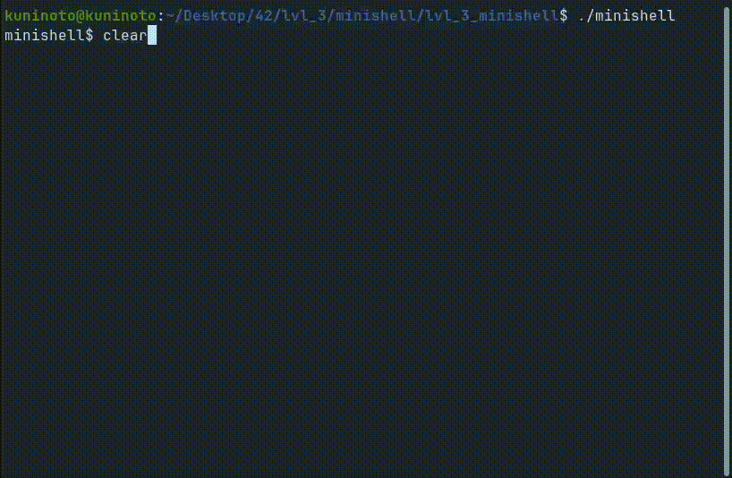

# minishell (42Heilbronn - 42Cursus) &nbsp; &nbsp;  

## Grade: 101/100

**Minishell** is a 42 school project that involves reimplementing a "mini" bash terminal. 
In this project, I've re-implemented the following built-in functions:

---
---

* 'echo' (with '-n' option and more)
* 'cd' (with relative or absolute path and more)
* 'env' (without options or arguments)
* 'pwd' (without options)
* 'export' (without options)
* 'unset' (without options)
* 'exit' (without options)

---
---

* Redirections (in and out to a file)
* Multi commands with pipes
* Manage the environment variables : you can use the '$' with 'echo' or in your redirections to print environment variables.
* Handling signals : 'ctrl-c' and 'ctrl-d'

---
---
